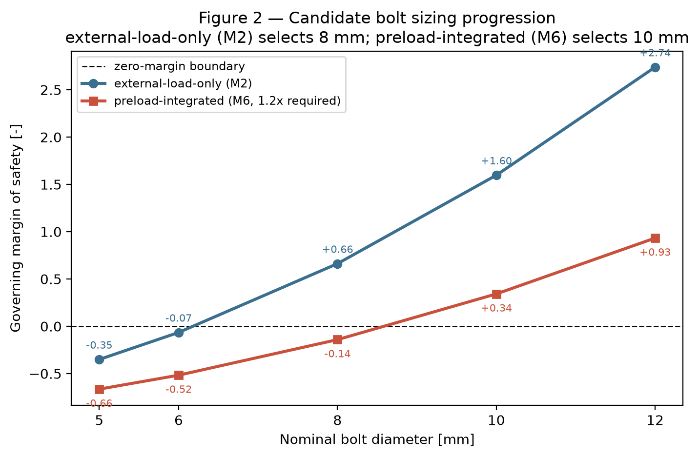

<title>Payload Attach Bolt Sizing</title>

# Payload Attach Bolt Sizing (STM-08)

An illustrative, fully-verified preliminary bolt/joint sizing and
installation screen for a payload-to-structure attach interface: rigid
bolt-group load distribution → external strength sizing → preloaded
joint closure/slip → preload-compatible strength → local joint checks
→ torque-installation robustness — one continuous, test-verified
analysis chain, built up milestone by milestone with independent
verification at every layer.

**The final result is an illustrative preliminary bolt/joint sizing and
installation screen, not a flight qualification or fastener
installation specification.**

> **Repository note**: this repository (`payload-attach-bolt-sizing-m6`)
> is the canonical continuation of STM-08, forked from
> [`payload-attach-bolt-sizing`](https://github.com/Sanjanakamboj/payload-attach-bolt-sizing)
> after Milestone 5. All prior milestone history and results are
> carried over unchanged.

## 1. Project objective

> Given a rigid payload interface and an idealized bolt group, how are
> launch forces and moments distributed to the individual bolts, and
> what bolt size and installation preload/torque provide a feasible
> design once bolt-group loads, bolt strength, joint closure/slip,
> preload capacity, local joint checks, and torque scatter are all
> considered together?

## 2. Key result

| Question | Answer |
|---|---|
| External-load-only sizing (M2) | **8 mm passes** (bolt 1, interaction, margin +0.66) |
| Joint-required preload (M3) | **≈29.26 kN/bolt** (slip-governed, bolt 0) |
| Selected installation preload (1.2× required) | **≈35.11 kN/bolt** |
| Preload-compatible strength (M6) | **8 mm no longer adequate** (preload margin −0.14); **10 mm selected** |
| 10 mm preload force window | **≈29.26 – 47.12 kN/bolt** (proof-governed ceiling) |
| Torque installation (M7) | K=0.20, scatter=±20%, s_max≈23.4% → **robust torque window ≈73.1–78.5 N·m**, selected midpoint ≈75.8 N·m |
| Local joint checks (M5) | bearing, edge-distance, spacing all **PASS** at 10 mm, comfortably |

**The illustrative 10 mm candidate is the smallest currently
demonstrated bolt that simultaneously satisfies the implemented joint
preload, bolt-strength, local-joint, and ±20% torque-installation
robustness screens.**



## 3. Engineering workflow

```
Milestone 1  Rigid bolt-group load distribution + equilibrium verification
Milestone 2  External-load-only tensile/shear/interaction strength sizing
Milestone 3  Preloaded joint closure (separation) and faying-surface slip screening
Milestone 4  Preload feasibility vs. proof/yield force, installation window
Milestone 5  Local joint checks (bearing/edge/spacing) + bolt-size trade
Milestone 6  Preload-compatible SERVICE strength (stress-based, reuses M2's interaction criterion)
Milestone 7  Torque-to-preload relation + preload-scatter installation robustness
Milestone 8  Final integrated audit, canonical script, figures, this README
```

Every later milestone **reuses** earlier layers' functions and results
exactly — no equation is ever silently re-derived or duplicated with a
different convention. `examples/final_payload_attach_assessment.py`
calls straight through this whole chain in one run.

## 4. Coordinate / load convention

- Interface plane **x-y**; **+z** = interface normal.
- Each bolt is an idealized point fastener at `(x_i, y_i)`, meters.
- **Fx, Fy** — in-plane shear resultants (N). **Fz** — axial/normal
  resultant (N), positive = **tension**; may be negative (compression),
  never silently clipped. **Mx, My** — overturning moments (N·m).
  **Mz** — in-plane torsional moment (N·m), positive by the right-hand
  rule (CCW viewed from +z).
- **All applied loads are referenced about the bolt-group centroid.**
  Bolt coordinates are translated to the centroid internally for load
  distribution; original coordinates are retained for reporting
  (verified translation-invariant).
- SI units throughout: meters, newtons, newton-meters, pascals.

## 5. Rigid bolt-group mechanics (Milestone 1)

Direct shear (equal split): `Vx_direct = Fx/n`, `Vy_direct = Fy/n`.

Torsional shear (centroid-relative, `J = sum(x_i^2+y_i^2)`):
`Vx_torsion,i = -Mz*y_i/J`, `Vy_torsion,i = Mz*x_i/J`.

Axial distribution `T_i = c0 + cx*x_i + cy*y_i`, solved from the
general 3×3 system `sum(T_i)=Fz`, `sum(y_i*T_i)=Mx`, `sum(-x_i*T_i)=My`
— not a formula specialized to circular patterns. **Signed axial
results (compression-side) are retained, never clipped.**

An independent equilibrium-recovery helper (a separate code path from
the distribution solve) confirms every result to floating-point
precision.

## 6. External bolt strength sizing (Milestone 2)

```
sigma_t = max(T_i, 0) / A_t          tau = V_i / A_s
FI = (sigma_t/S_t)^2 + (tau/S_s)^2   (illustrative quadratic interaction, pass if FI<=1)
```

Governing mode (tension/shear/interaction) resolved deterministically:
interaction governs outright only when both tensile and shear demand
are present; pure-tension/pure-shear bolts tie exactly with
interaction and the specific mode wins that tie.

## 7. Preloaded joint closure/slip (Milestone 3)

```
C = k_b/(k_b+k_m)                    T_sep,i = max(T_ext,i, 0)
Delta_F_b,i = C*T_sep,i              Delta_F_m,i = (1-C)*T_sep,i
F_clamp,i = F_preload - (1-C)*T_sep,i          (joint closed iff >= 0)
V_cap,i = mu*n_interfaces*max(F_clamp,i, 0)    (local slip capacity)
```

Slip uses each bolt's Milestone 1 shear demand directly, so Mz's
contribution is never lost. Required preload solved in closed form for
both separation and slip; the larger governs.

## 8. Preload-compatible service strength (Milestone 6)

```
F_b,total,i = F_preload + C*T_sep,i            sigma_preload = F_preload/A_t
sigma_service,i = F_b,total,i / A_t            tau_service,i = V_i/A_s
FI_service = (sigma_service/S_t)^2 + (tau_service/S_s)^2     (SAME M2 criterion)
```

Valid **only** while `joint_closed AND no_slip` (Milestone 3); a
separated or slipped joint forces the integrated result to FAIL
regardless of the raw stress margins. Three independent preload
ceilings — proof (`S_proof*A_t`), service-tension
(`S_t*A_t - C*T_sep`), and interaction — combine into
`F_preload,max = min(proof, tension, interaction)`.

## 9. Existing local joint checks (Milestone 5)

Bearing (`sigma = V_i/(d*t)`, using Milestone 1's **in-plane shear**,
never axial load), edge-distance (`e/d` vs. 1.5), and pairwise spacing
(`s/d` vs. 3.0) — geometry/stress screens only, not detailed
tear-out/net-section calculations. Thread stripping is **explicitly not
modeled** (no source-verified formula could be established with
confidence) and never gates selection. At the final 10 mm selection,
all three pass comfortably (bearing MS +4.59, e/d=5.00, s/d=38.27).

## 10. Torque/preload installation robustness (Milestone 7)

```
T_install = K*F_preload*d             F_low = F_nominal*(1-s), F_high = F_nominal*(1+s)
T_min = K*d*F_required/(1-s)          T_max = K*d*F_max/(1+s)     (robust iff T_min <= T_max)
s_max = (F_max - F_required)/(F_max + F_required)
```

`s_max` is the central diagnostic: a force window can be feasible while
its torque window is not, once commanded scatter exceeds `s_max`.

## 11. Final preliminary selection

`illustrative preliminary bolt/joint selection` — **10 mm**, idealized
gross circular shank area (A=πd²/4, no ISO/SAE thread convention),
against the illustrative material (tensile 800 MPa / shear 480 MPa /
proof 600 MPa): required joint preload 29,258.2 N/bolt, max bolt
preload 47,123.9 N/bolt (proof-governed), selected installation preload
35,109.8 N/bolt (1.2× required), selected installation torque ≈75.8
N·m at K=0.20/±20% scatter, governing constraint **preload** (margin
+0.342). **Final integrated status: PASS.**

## 12. Sensitivity (see `examples/final_payload_attach_assessment.py` for full tables)

- **Preload factor**: higher preload improves slip margin but
  monotonically consumes bolt preload margin (crosses to FAIL at 2.0×
  required).
- **Faying-surface friction**: lower μ raises required preload and
  shrinks both `s_max` and the torque window (μ=0.10 has no feasible
  force window at all).
- **Load fraction C**: higher C lowers required preload slightly but
  raises max total bolt tension and worsens interaction margin — a
  closure-vs-bolt-strength trade, not a free improvement.
- **Preload scatter / nut factor**: torque window shrinks monotonically
  with scatter (crossing infeasible between 20% and 25%, matching
  s_max=23.4%); both torque bounds scale exactly linearly with K,
  which never changes the underlying force window or `s_max`.

## 13. Verification

**260/260 automated tests pass.** Independently verified: circular-
pattern analytical identities (J=NR², Ix=Iy=J/2); direct-shear and
torsional-moment equilibrium recovery; axial force/moment recovery;
translation invariance; a fully hand-derived 4-bolt cross-pattern case;
strength hand calculations and exact FI boundary; load/area/allowable
scaling; preload force-balance identity and exact separation/slip
boundaries; required-preload analytical checks; proof/tension/
interaction preload ceilings by independent hand calculation; exact
force-window boundaries; a dedicated M2-pass/M6-fail candidate
construction (8 mm); torque/preload round trips; exact torque-window
boundary and `s_max` derivation; monotonic scatter/K/μ sensitivity;
deterministic governing-bolt/mode logic at every layer; non-mutation
between every pair of layers.

## 14. Engineering interpretation

Rigid-interface statics determine which bolt sees the highest axial/
shear demand (**A**). External sizing alone is incomplete — 8 mm passes
it comfortably (**B**) — because joint closure and friction require
real preload (≈29 kN/bolt here) that the external-only check never
sees (**C**). That preload itself adds substantial tensile stress
before any launch load is applied (**D**), so a useful design needs the
minimum preload required by closure/slip to sit below the maximum
preload the bolt can structurally carry (**E**). Torque control
delivers a *scatter band* around a nominal preload, not a single value,
so robust installation requires the **entire band** to fit inside that
force window (**F**) — an acceptable force window can still be too
narrow for torque control (8 mm here). The final candidate can
therefore be **larger** than the external-load-only candidate once
installation/preload robustness governs (**G**). Lower interface
friction raises the preload floor and can eliminate the installation
window entirely (**H**). Throughout: **this project remains a
preliminary analytical screening model** (**I**).

## 15. Limitations

**Load distribution**: rigid interface, equal bolt stiffness, linear
elastic distribution, signed compression-side result without contact
redistribution.

**Strength**: illustrative material allowables, idealized gross
circular candidate areas, illustrative quadratic interaction, no
standard-specific fastener allowables.

**Preload**: one scalar equivalent `C`, prescribed preload mechanics,
no embedment/relaxation, no thermal preload change, no nonlinear
separation/contact redistribution.

**Friction**: simplified local clamp-proportional capacity, no detailed
contact-pressure distribution, no slipped-state load redistribution.

**Torque**: simple `T=K*F*d`, one lumped `K`, symmetric preload
scatter, no separate thread/bearing friction, no torque-angle model, no
direct-tension measurement model.

**Local joint** (Milestone 5): bearing/edge/spacing are geometry/stress
screens only, not detailed tear-out/net-section calculations; the
circular plate boundary is specific to this project's pattern; the
spacing criterion is a general (non-aerospace) structural-steel
convention; thread stripping is explicitly not modeled.

**Other**: no fatigue, no certification claim of any kind.

## 16. Repository structure

```
src/payload_bolts/
  geometry.py, loads.py, solver.py       Milestone 1 — geometry, loads, rigid bolt-group solver
  strength.py                             Milestone 2 — external-load-only strength
  preload.py                              Milestone 3 — preloaded joint closure/slip
  preload_limits.py                       Milestone 4 — proof/yield installation window
  joint_local_checks.py                   Milestone 5 — bearing/edge/spacing + bolt-size trade
  preloaded_strength.py                   Milestone 6 — preload-compatible service strength
  torque_preload.py                       Milestone 7 — torque/preload installation robustness
tests/            260 tests across 12 files, one per module above
examples/         one runnable script per milestone + final_payload_attach_assessment.py
scripts/          generate_figures.py (Milestone 8 portfolio figures)
results/figures/  4 deterministic PNG figures
```

## 17. Reproduction

```bash
python3 -m venv .venv
source .venv/bin/activate
pip install -e ".[dev]"
pytest -q                                          # 260 passed
python examples/payload_attach_sanity.py           # Milestone 1
python examples/bolt_strength_sizing.py            # Milestone 2
python examples/preloaded_joint_screening.py       # Milestone 3
python examples/preload_feasibility_screening.py   # Milestone 4
python examples/bolt_candidate_trade.py            # Milestone 5
python examples/preload_compatible_bolt_sizing.py  # Milestone 6
python examples/torque_preload_installation.py     # Milestone 7
python examples/final_payload_attach_assessment.py # Milestone 8, final integrated result
python scripts/generate_figures.py                 # regenerates results/figures/
```

## 18. License

MIT License — see [`LICENSE`](LICENSE).
